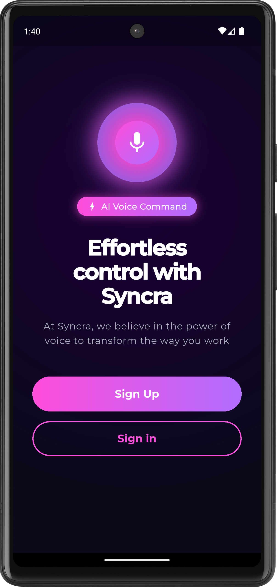
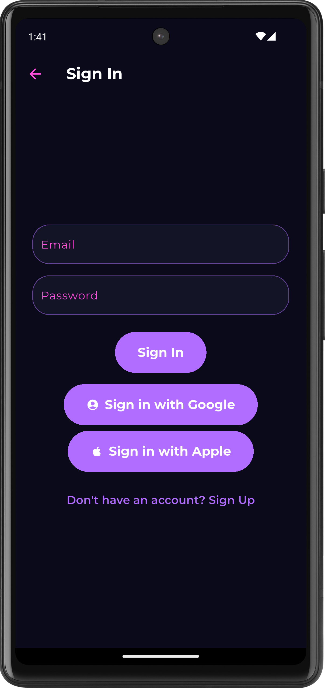
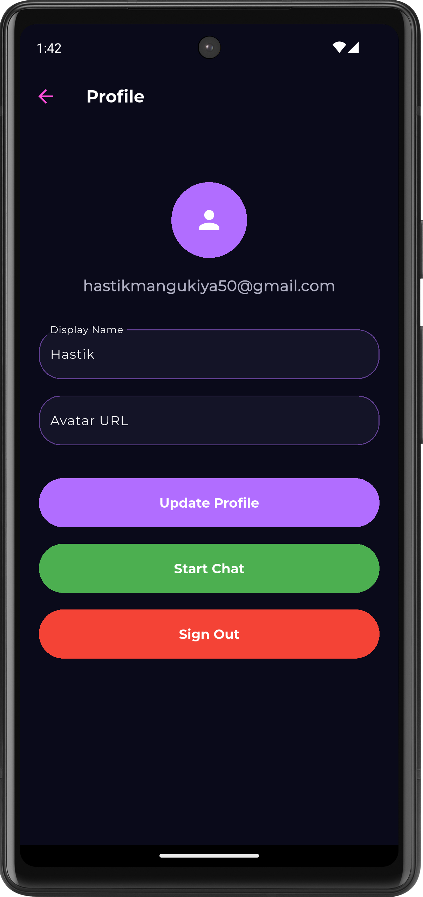
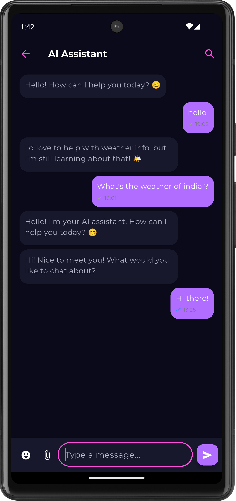

<h1 align="center" id="title">Flutter / AI ChatBot</h1>

<p align="center"></p>

<p id="description">A professional AI chatbot mobile application built with Flutter Cursor Supabase Provider Hive and 21st.dev for 3D UI elements.</p>

<h2>Project Screenshots:</h2>



  
  
<h2>🧐 Features</h2>

Here're some of the project's best features:

*   User authentication (email/password social login)
*   Real-time chat with AI assistant
*   Modern chat UI with media emoji and typing indicators
*   Interactive 3D AI avatar
*   Offline support and encrypted local storage
*   MVVM architecture clean code and comprehensive testing
*   Responsive design that adapts to all device sizes

<h2>🛠️ Installation Steps:</h2>

<p>1. Clone the repository:</p>

```
git clone https://github.com/hastik07/Chat-Bot.git
```

<p>2. Install dependencies:</p>

```
flutter pub get
```

<p>3. Run the application:</p>

```
flutter run
```

  
  
<h2>💻 Built with</h2>

Technologies used in the project:

*   Flutter
*   Dart
*   Cursor
*   Supabase
*   Hive
*   Provider

<h2>🛡️ License:</h2>

This project is licensed under the MIT
